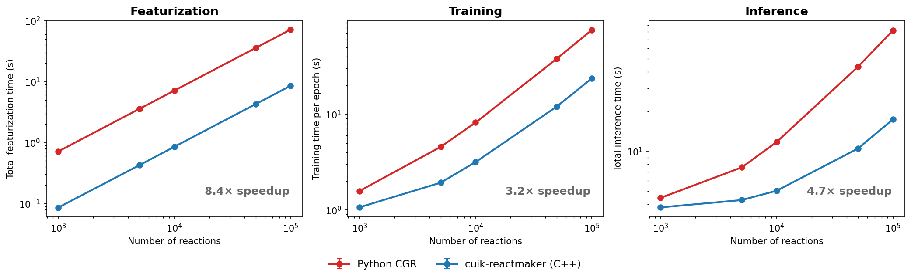
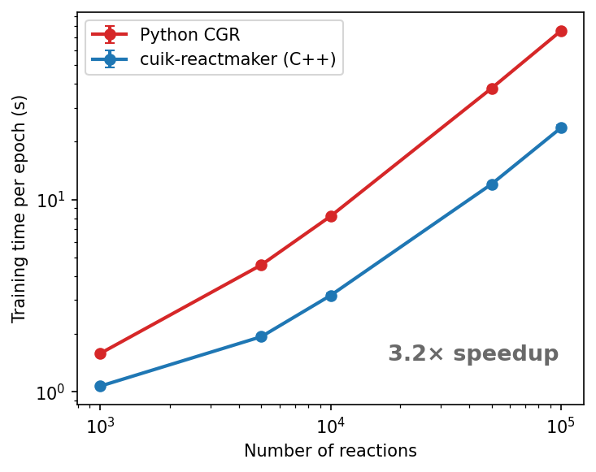
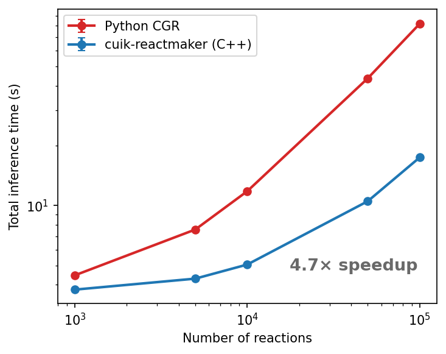

# cuik-reactmaker-benchmarks

Rigorous timing benchmarks for C++ vs Python CGR reaction featurization in [Chemprop](https://github.com/chemprop/chemprop), powered by [cuik-molmaker](https://github.com/NVIDIA-Digital-Bio/cuik-molmaker).

Benchmarks the `--use-cuikmolmaker-featurization` flag (C++ `batch_reaction_featurizer`) against the default Python `CondensedGraphOfReactionFeaturizer` across three tiers:

| Tier | Metric | Script |
|------|--------|--------|
| Featurization only | µs/reaction and total time, sweep batch size / dataset size | `benchmarks/featurization/bench_featurization.py` |
| End-to-end training | s/epoch, sweep dataset size | `benchmarks/training/bench_training.py` |
| Inference throughput | total s, sweep dataset size | `benchmarks/inference/bench_inference.py` |

## Results

> Measured on RGD1 (353k reactions), V2 featurizer / REAC_DIFF mode, batch_size=50, GPU: NVIDIA GeForce RTX 3090.



### Headline speedups

| Tier | Dataset | Baseline | C++ CGR | **Speedup** |
|------|---------|----------|---------|-------------|
| Featurization | 100k reactions | 71.4 s | 8.5 s | **8.4×** |
| Training (per epoch) | 100k reactions | 75.6 s | 23.6 s | **3.2×** |
| Inference | 100k reactions | 81.8 s | 17.5 s | **4.7×** |

### Featurization


**8–8.4× speedup** is consistent across all batch sizes (8–1024), confirming the gain is from C++ computation, not batching overhead. Per-reaction times at batch_size=50:

| Batch size | Python CGR | C++ CGR | Speedup |
|---|---|---|---|
| 8 | ~707 µs/rxn | ~92 µs/rxn | 7.7× |
| 50 (default) | ~700 µs/rxn | ~84 µs/rxn | **8.3×** |
| 256 | ~701 µs/rxn | ~84 µs/rxn | 8.4× |
| 1024 | ~695 µs/rxn | ~92 µs/rxn | 7.5× |

### Training



Speedup grows with dataset size and converges to **~3.2×** at 50k–100k reactions. Both paths use on-the-fly featurization (`--no-cache`) for a fair comparison.

| Dataset size | Baseline (s/epoch) | C++ CGR (s/epoch) | Speedup |
|---|---|---|---|
| 1k | 1.58 | 1.07 | 1.5× |
| 5k | 4.57 | 1.93 | 2.4× |
| 10k | 8.19 | 3.17 | 2.6× |
| 50k | 37.97 | 12.04 | 3.2× |
| 100k | 75.58 | 23.61 | **3.2×** |

### Inference



Inference speedup is still growing at 100k (not yet converged) due to fixed model-loading overhead amortizing with N. At 100k: **4.7×**.

| Dataset size | Baseline (s) | C++ CGR (s) | Speedup |
|---|---|---|---|
| 1k | 4.46 | 3.78 | 1.2× |
| 5k | 7.58 | 4.30 | 1.8× |
| 10k | 11.80 | 5.06 | 2.3× |
| 50k | 43.57 | 10.52 | 4.1× |
| 100k | 81.84 | 17.45 | **4.7×** |

## Dataset

**RGD1** (Zhao et al.) — 353,984 atom-mapped reactions with activation energies (kcal/mol).
- Citation: https://doi.org/10.5281/zenodo.10078142
- Local path (not committed): `/home/akshatz/bond_order_free/barriers_rgd1/dataset/rgd1_data.csv`
- Column `smiles` (R>>P atom-mapped SMILES), target `ea`

## Environment

All benchmarks run in the `chemprop_cuik_rxn` conda env with chemprop's `cuik_reactmaker` branch checked out.

```bash
conda activate chemprop_cuik_rxn
cd ~/chemprop && git checkout cuik_reactmaker
cd ~/projects/cuik-reactmaker-benchmarks
```

## Quick start

Run the full benchmark suite end-to-end:

```bash
conda activate chemprop_cuik_rxn
cd ~/chemprop && git checkout cuik_reactmaker
cd ~/projects/cuik-reactmaker-benchmarks
bash scripts/experiments.sh 1   # pass GPU ID (default: 1)
```

This runs all six steps sequentially:
1. Dataset subsets (one-time, skipped if already exist)
2. Featurization per-reaction timing (~10 min, CPU)
3. Featurization total time vs N (~5 min, CPU)
4. Training benchmark (~hours, GPU)
5. Inference benchmark (~30 min, GPU)
6. Figures + tables

Or run individual steps:

```bash
# Featurization
python benchmarks/featurization/bench_featurization.py \
    --mode per-rxn \
    --data-path /home/akshatz/bond_order_free/barriers_rgd1/dataset/rgd1_data.csv \
    --batch-sizes 8 16 32 64 128 256 512 1024 \
    --n-warmup 5 --n-trials 50 \
    --output results/raw/featurization_timing.csv

# Training
CUDA_VISIBLE_DEVICES=1 python benchmarks/training/bench_training.py \
    --data-dir data/ --output results/raw/training_timing.csv \
    --epochs 5 --batch-size 50 --seeds 0 1 2

# Inference (requires a trained model)
CUDA_VISIBLE_DEVICES=1 python benchmarks/inference/bench_inference.py \
    --data-dir data/ --model-path <path/to/model.pt> \
    --output results/raw/inference_timing.csv --n-trials 3

# Figures and tables
python analysis/plot_featurization.py
python analysis/plot_training.py
python analysis/plot_inference.py
python analysis/make_tables.py
```

## Results layout

```
results/
├── raw/                              # committed — raw timing CSVs
│   ├── featurization_timing.csv     # per-reaction time vs batch size
│   ├── featurization_total.csv      # total time vs dataset size
│   ├── training_timing.csv          # s/epoch by dataset size and path
│   └── inference_timing.csv         # total inference time by dataset size
├── figures/                          # committed — paper-ready plots
│   ├── fig1_featurization_speedup.pdf
│   ├── fig2_training_speedup.pdf
│   └── fig3_inference_speedup.pdf
└── tables/
    ├── featurization_by_batch.csv
    ├── training_by_size.csv
    ├── inference_by_size.csv
    └── summary_table.csv
```

## Repo structure

```
cuik-reactmaker-benchmarks/
├── README.md
├── .gitignore
├── data/                              # gitignored; filled by prepare_subsets.py
├── scripts/
│   ├── experiments.sh                 # full end-to-end benchmark suite
│   └── prepare_subsets.py             # create rgd1_{N}k.csv subsets
├── benchmarks/
│   ├── featurization/
│   │   └── bench_featurization.py    # Exp 1: pure featurization timing
│   ├── training/
│   │   └── bench_training.py         # Exp 2: end-to-end training time
│   └── inference/
│       └── bench_inference.py        # Exp 3: inference throughput
├── results/
└── analysis/
    ├── plot_featurization.py
    ├── plot_training.py
    ├── plot_inference.py
    └── make_tables.py
```

## Experimental design

- **Featurization**: batch sizes 8–1024; full RGD1 pool; 5 warmup + 50 timed trials; median µs/reaction. Also: total time vs. N at fixed batch_size=50.
- **Training**: dataset sizes 1k–300k; batch_size=50; 5 epochs; 3 seeds; both paths use `--no-cache` (on-the-fly featurization) for a fair comparison.
- **Inference**: predict on held-out sets of size 1k–100k; 3 trials; shared baseline reference model (100k, seed 0).
- All benchmarks use V2 featurizer mode, REAC_DIFF reaction mode (Chemprop defaults).
- Both paths run in `chemprop_cuik_rxn` env; only `--use-cuikmolmaker-featurization` flag differs.
