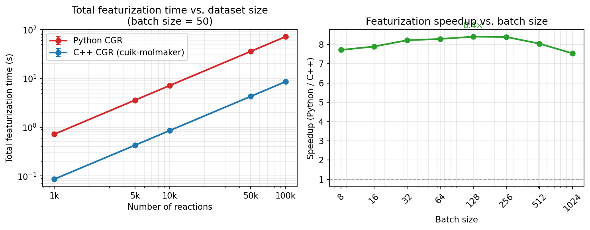

# cuik-reactmaker-benchmarks

Rigorous timing benchmarks for C++ vs Python CGR reaction featurization in [Chemprop](https://github.com/chemprop/chemprop), powered by [cuik-molmaker](https://github.com/NVIDIA-Digital-Bio/cuik-molmaker).

Benchmarks the `--use-cuikmolmaker-featurization` flag (C++ `batch_reaction_featurizer`) against the default Python `CondensedGraphOfReactionFeaturizer` across three tiers:

| Tier | Metric | Script |
|------|--------|--------|
| Featurization only | µs/reaction and total time, sweep batch size / dataset size | `benchmarks/featurization/bench_featurization.py` |
| End-to-end training | s/epoch, sweep dataset size | `benchmarks/training/bench_training.py` |
| Inference throughput | total s, sweep dataset size | `benchmarks/inference/bench_inference.py` |

## Results

### Featurization speedup (RGD1, 353k reactions, V2/REAC_DIFF)



**Left:** Total featurization time scales linearly with dataset size. At 100k reactions (batch size 50), the Python path takes ~80 s; the C++ path takes ~9 s — **~9× faster**.

**Right:** Speedup is consistent at **7–9× across all batch sizes** (8–1024), confirming the gain comes from C++ computation speed rather than batching overhead.

| Batch size | Python CGR | C++ CGR | Speedup |
|---|---|---|---|
| 8 | ~710 µs/rxn | ~95 µs/rxn | **7.5×** |
| 50 (default) | ~710 µs/rxn | ~85 µs/rxn | **8.3×** |
| 512 | ~710 µs/rxn | ~84 µs/rxn | **8.5×** |

Training and inference benchmarks are in progress.

## Dataset

**RGD1** (Grambow et al.) — 353,984 atom-mapped reactions with activation energies (kcal/mol).
- Citation: https://doi.org/10.5281/zenodo.10078142
- Local path (not committed): `/home/akshatz/bond_order_free/barriers_rgd1/dataset/rgd1_data.csv`
- Column `smiles` (R>>P atom-mapped SMILES), target `ea`

## Environment

All benchmarks run in the `chemprop_cuik_rxn` conda env with chemprop's `cuik_reactmaker` branch checked out. Both paths (baseline and cuik) use the same env — `--use-cuikmolmaker-featurization` is the only difference.

```bash
conda activate chemprop_cuik_rxn
cd ~/chemprop && git checkout cuik_reactmaker
cd ~/projects/cuik-reactmaker-benchmarks
```

## Quick start

```bash
# Step 1: Featurization microbenchmark (~10 min, CPU only)
python benchmarks/featurization/bench_featurization.py \
    --mode per-rxn \
    --data-path /home/akshatz/bond_order_free/barriers_rgd1/dataset/rgd1_data.csv \
    --batch-sizes 8 16 32 64 128 256 512 1024 \
    --n-warmup 5 --n-trials 50 \
    --output results/raw/featurization_timing.csv

python benchmarks/featurization/bench_featurization.py \
    --mode total \
    --data-path /home/akshatz/bond_order_free/barriers_rgd1/dataset/rgd1_data.csv \
    --n-reactions 1000 5000 10000 50000 100000 \
    --batch-size 50 \
    --n-warmup 2 --n-trials 5 \
    --output results/raw/featurization_total.csv

# Step 2: Prepare dataset subsets (run once, requires ~500 MB disk)
python scripts/prepare_subsets.py \
    --source /home/akshatz/bond_order_free/barriers_rgd1/dataset/rgd1_data.csv \
    --outdir data/

# Step 3: Training benchmarks (~hours, GPU required)
python benchmarks/training/bench_training.py \
    --data-dir data/ \
    --output results/raw/training_timing.csv \
    --epochs 5 --batch-size 50 --seeds 0 1 2

# Step 4: Inference benchmarks
python benchmarks/inference/bench_inference.py \
    --data-dir data/ \
    --output results/raw/inference_timing.csv \
    --n-trials 3

# Step 5: Figures and tables
python analysis/plot_featurization.py   # → results/figures/fig1_featurization_speedup.pdf
python analysis/plot_training.py        # → results/figures/fig2_training_speedup.pdf
python analysis/plot_inference.py       # → results/figures/fig3_inference_speedup.pdf
python analysis/make_tables.py          # → results/tables/summary_table.csv
```

## Results layout

```
results/
├── raw/                              # committed — raw timing CSVs
│   ├── featurization_timing.csv     # per-reaction time vs batch size
│   ├── featurization_total.csv      # total time vs dataset size
│   ├── training_timing.csv          # (pending)
│   └── inference_timing.csv         # (pending)
├── figures/                          # committed — paper-ready plots
│   ├── fig1_featurization_speedup.pdf
│   ├── fig2_training_speedup.pdf     # (pending)
│   └── fig3_inference_speedup.pdf    # (pending)
└── tables/
    └── summary_table.csv             # (pending)
```

## Repo structure

```
cuik-reactmaker-benchmarks/
├── README.md
├── .gitignore
├── data/                              # gitignored; filled by prepare_subsets.py
├── scripts/
│   └── prepare_subsets.py             # create rgd1_{N}k.csv subsets
├── benchmarks/
│   ├── featurization/
│   │   └── bench_featurization.py    # Exp 1: pure featurization timing
│   ├── training/
│   │   └── bench_training.py         # Exp 2: end-to-end training time
│   └── inference/
│       └── bench_inference.py        # Exp 3: inference throughput
├── results/
└── analysis/
    ├── plot_featurization.py
    ├── plot_training.py
    ├── plot_inference.py
    └── make_tables.py
```

## Experimental design

- **Featurization**: batch sizes 8–1024 (powers of 2); full RGD1 pool (354k reactions); 5 warmup + 50 timed trials; report median µs/reaction. Also: total time vs. N at fixed batch_size=50.
- **Training**: dataset sizes 1k, 5k, 10k, 50k, 100k; batch_size=50; 5 epochs; 3 seeds; metric = total wall-clock seconds and s/epoch.
- **Inference**: predict on held-out sets of size 1k–100k; 3 trials; metric = total wall-clock seconds.
- All benchmarks use V2 featurizer mode, REAC_DIFF reaction mode (Chemprop defaults).
- Both paths run in `chemprop_cuik_rxn` env; only `--use-cuikmolmaker-featurization` flag differs.
